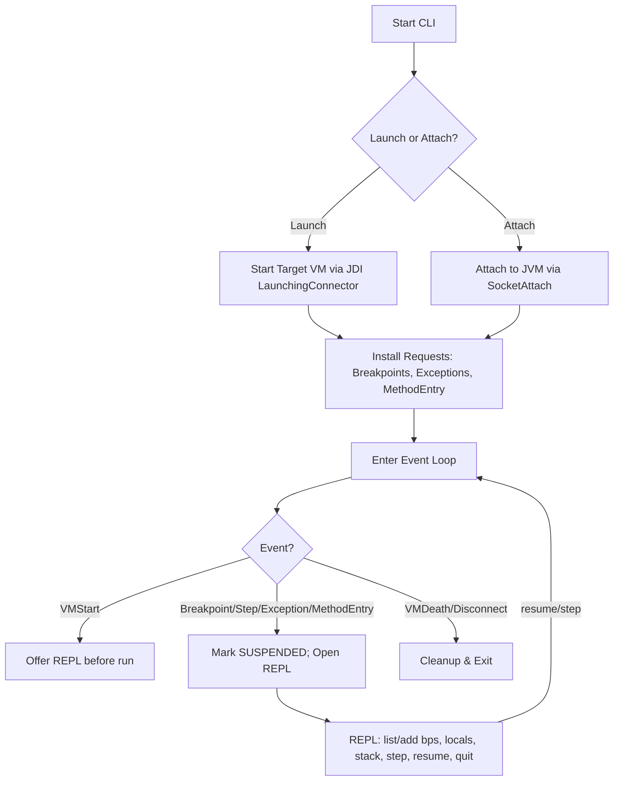
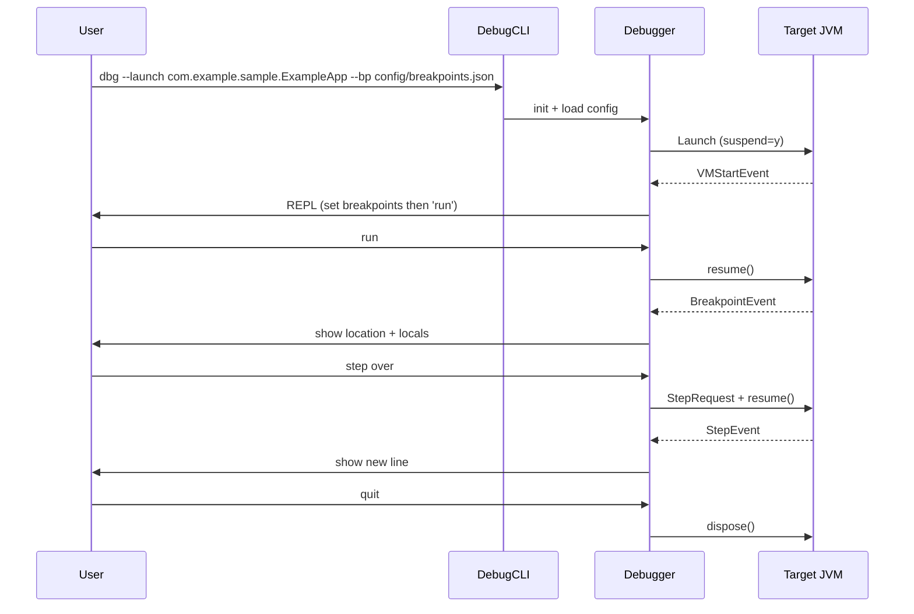

# java-debugging-system

A minimal yet practical Java CLI debugger built with the Java Debug Interface (JDI). Perfect for learning JVM debugging internals and showcasing systems design on GitHub.

## Features
- Launch or attach to JVMs.
- Breakpoints by `Class:line` or `Class#method` (method entry).
- Step in/over/out; show stack, threads, locals; print variables/fields.
- Pause on exceptions (caught/uncaught/all).
- Structured JSONL logs for events.
- Script mode for automated workflows and tests.

## Architecture Diagrams

### Flowchart (core lifecycle)


### Sequence (user–debugger–target JVM)


## Quick Start (Local)
```bash
# build & run tests
./scripts/build.sh

# run debugger against the sample app with config breakpoints
./scripts/run_debugger.sh
```

Or manually:
```bash
./gradlew clean test shadowJar
java -jar build/libs/java-debugging-system-all.jar   --launch com.example.sample.ExampleApp   --bp config/breakpoints.json
```

## Quick Start (Docker)
```bash
docker build -t java-debugging-system .
# Building the image runs all tests in the build stage.
# To run the packaged app:
docker run --rm -it java-debugging-system
```

> **Note:** The runtime image uses a JDK (not a JRE) so JDI classes are available at runtime.

## CLI Commands (REPL)
- `help` — show commands
- `break <Class:line>` — line breakpoint
- `break <Class#method>` — break on method entry (class-filtered)
- `list` — list breakpoints
- `run` / `resume` / `c` — continue
- `step in|over|out` — single step
- `where` / `stack` — show stack
- `locals` — current frame locals
- `print <name|this.field>` — inspect a variable or field
- `threads` — list threads
- `trace on|off` — toggle event tracing to log/console
- `quit` — detach/exit

## Config
See `config/breakpoints.json`.

## Author
**Ujjwal <ujjwal02tiwari@gmail.com >**

## License
MIT
